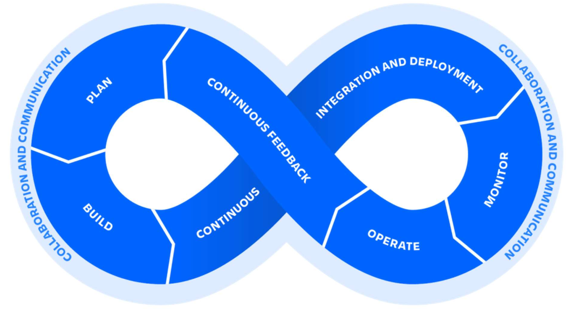
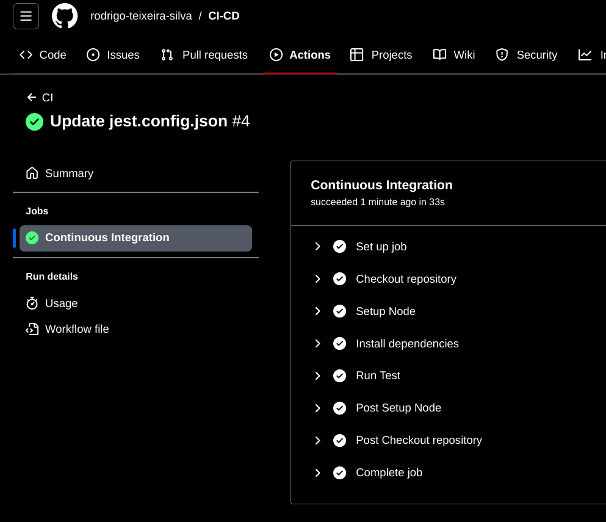
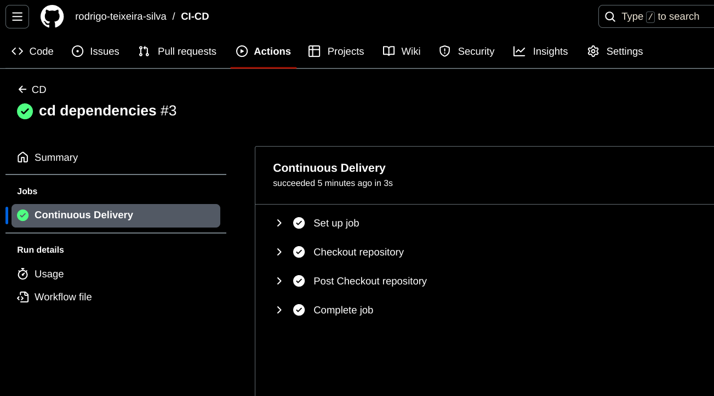

# Criação CI/CD

## CI (Integração Contínua) e seus objetivos. 
O CI é uma prática de desenvolvimento em que as alterações de código são integradas regularmente a um repositório principal. É executado testes para garantir que o novo código não quebre a aplicação existente. Mantém a estabilidade do código, enquanto

## CD (Entrega Contínua)e seus objetivos.
Automatiza o processo de implantação da aplicação, entregando novas funcionalidades ou correções de bugs aos usuários de forma rápida e confiável. Automatiza a implementação e implantação do software em produção.

